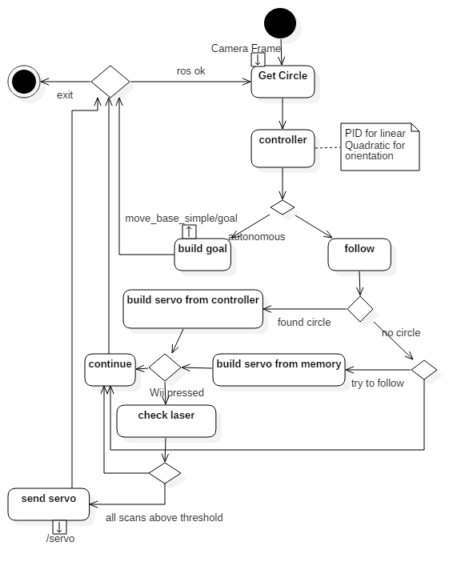
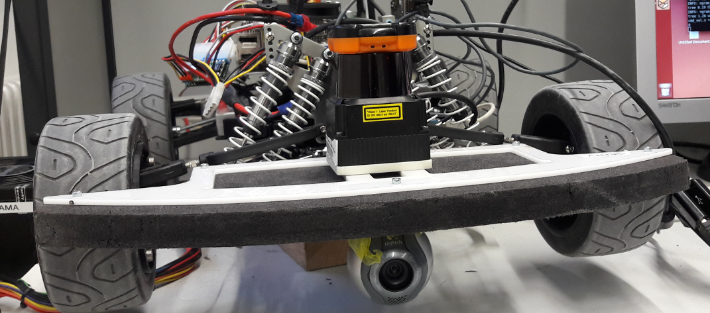

tas_car
=======


### Follow Ball (Raimund Zille)
This programm will make the car follow a monochrome ball.
It is splitted in three parts:

1. The class [find_ball](follow_ball/include/follow_ball.h) which filters the images of the camera for the ball using OpenCV.
2. The ros-node [navigation_goals_node](follow_ball/src/navigation_goals.cpp) which uses the class [find_ball](follow_ball/include/follow_ball.h) to get information about the ball as well as has the controllers to determine the angular and linear speed and publishs this to the car.
3. The programm [calibrate_params](follow_ball/src/calibrate_params.cpp) which can be used to create a [threshold_matrix.xml](follow_ball/threshold_matrix.xml) for any ball.



Try to put the camera below the bumper for best result:


#### Requirements:
* camera
* monochrome ball
* drivable car
* wii-controler

#### Calibrate params for new ball
calibrate parameters for monochrome ball with following command:
```
rosrun follow_ball calibrate_params
```
This will need a monitor to display the results. 
Use the controller such that the ball is white in every picture. In the best case scenario the final image only contains the ball. This doesn't have to be done for the yellow ball (refering to the one I used in the videos) as it is allready calibrated.
If you wish to save the old parameters just rename the file [threshold_matrix.xml](follow_ball/threshold_matrix.xml)!

#### Run the code
Launch the programm with following command:
```
roslaunch tas hardware.launch
rosrun follow_ball navigation_goals_node
```
This will start the hardware of the car as well as the *navigation_goals_node* which will do the magic.

Connect the Wii-Controller and press the **Nunchuck C-Button** to allow the node to publish */servo*.

With the yellow ball it works best in the cooridoors as in the lab there are many yellow things such as cables which might be detected as a ball.
I think a red or green ball would generally work better in that environment.

in the file [navigation_goals.cpp](follow_ball/src/navigation_goals.cpp) you can set the param *use_autonomous* to *true/false*

| value | effect |
|-------|--------|
| true | navigation_goals_node sends move_base_simple/goals (not tested!)|
| false | navigation_goals_node sends servo  !WARNING! this will most likley not dodge any obstacles|


I tryed to implement that it checks the laser_scan ranges when autonomous is set to false but i couldn't test that anymore.

You can change parameters in the [navigation_goals.cpp](follow_ball/src/navigation_goals.cpp)
important params:
* **DESIRED_R** set it to the value depending on the size of the ball and the image (demo was 55 with a 640pixel width image, the ball had r ca. 1.5cm
* **ANGLE_MAX** depends on the viewing angle of the camera (set it a bit higher to be sure)
* **MAX_SEC_TRY_TO_FOLLOW** how long shall the car try to find the ball if it sees none (only important if autonomous is set to false)
for detailed information check the [documentation](follow_ball_doxygen)

//TODO Videos of the programm using autonomous set to false can be found [here](follow_ball_video)

#### Using autonomous stack
If you wish to use the autonomous driving stack you should check if it makes any sense using the *find_consistent_circle* method of [find_ball](follow_ball/include/follow_ball.h) as well as the low processing rate set in [navigation_goals.cpp](follow_ball/src/navigation_goals.cpp).

Use **this** at your own risk as this functionality **isn't tested!**

#### Improvment
1. Better algorithm to find a conistent ball.
2. If camera shall be used for other tasks as well determine angular speed with respect to the radius of the ball and the y-coordinate of the center of the ball. This way the camera can be put on top of the car.
3. Remove hardcoded parameters.
4. Improve use of laserscan so the car is capable of following the ball even if it is e.g near a wall.

#### KNOWN BUG:
If it doesnt find the *threshold_matrix.xml*, do *catkin_make* in a terminal, then start the *navigation_goals_node* or *calibrate_params* in the same terminal

### Using it with another setup
Make sure you edit the servo-command topic such that it fits your robot if you wanna directly publish on the servo. Also you most likley have to change the callback if the wii-button is pressed. Everything in the file [navigation_goals.cpp](follow_ball/src/navigation_goals.cpp).


